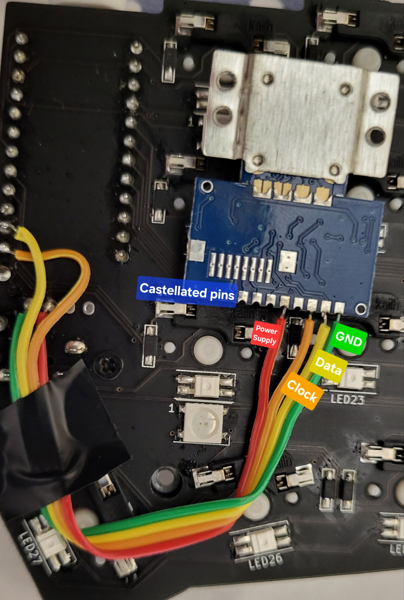

# Executables

* **qmk_file_inject.sh:** inject user files in qmk_firmware

* **flash.sh:** execute qmk_file_inject and qmk flash in user keyboard folder

* **commit_all.sh:** commits all changes, both of qmk_firmware submodule and my_qmk module (main folder) 

# User files and changes

* ### Keymap.c, rules.mk, config.h

Add in folder:
```
/home/elil50/Documents/qmk/qmk_firmware/keyboards/crkbd/keymaps
```

The folder:
```
Elil_50
```

* ### PS/2 Driver Trackpoint

The host needs pull-up resistors on PS/2 DATA and CLK lines. The built-in pullup resistors from the host 4k to 100k are acceptable. 
So I need to add those pull-up resistors (didn't do it), or apply the following patch:

Add in line 150 of:
```
/home/elil50/Documents/qmk/qmk_firmware/platforms/chibios/drivers/vendor/RP/RP2040/ps2_vendor.c
```
The following line:
```
PAL_RP_PAD_PUE |
```
So that it looks like:
```c
    // clang-format off
    iomode_t pin_mode = PAL_RP_PAD_IE |
                        PAL_RP_GPIO_OE |
                        PAL_RP_PAD_SLEWFAST |
                        PAL_RP_PAD_DRIVE12 |
                        PAL_RP_PAD_PUE |
```

# Hardware

* 2 Microcontroller: Elite-Pi
* 1 Trackpoint: SK8707-01-002(3.3V) Integrated

# Trackpoint pinout setup

