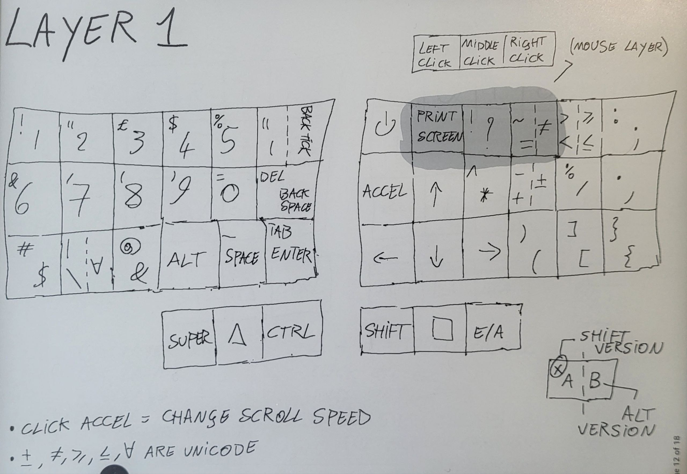
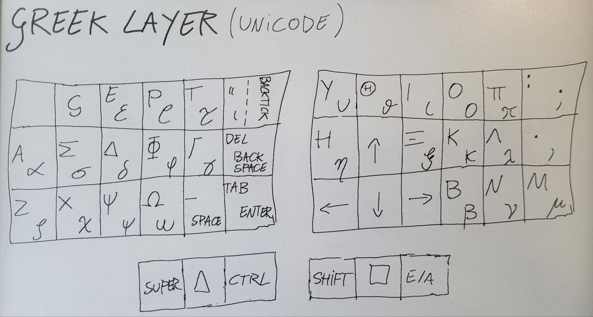

# Elil_50 Corne keyboard QMK firmware


This project is subdivided as it follows:
1. An explaination of my custom firmware, written for the 6 columns [Corne keyboard V3](https://github.com/foostan/crkbd/) (a 42 keys ortholinear split keyboard), based on [QMK](https://github.com/qmk/qmk_firmware/) framework.
2. My hardware customization, from case printable files to mounting the trackpoint.
3. My desktop enviroment shortcuts.

# Just a keyboard for show?


I coded, but my hands always feel lost on big keyboards: I couldn't learn touch typing and my eyes hurt each time I took a quick glance at the keyboard.<br/>
I coded, but my desk is comically high and I had the habit of pressing my wrists against its edges: my knuckles literally bled for months due to circulation issues. I tried using a comically high chair, but then it was my knees' turn to ache. I bought a footrest, but it didn't change anything.

That's when I went down the ergonomic keyboard rabbit hole and discovered split keyboards.

I needed to mount it to my chair to stop worrying about the desk height.<br/>
I needed just the right amount of keys: too few and it would reduce the typing speed, too many and I would lose my hands on it.<br/>
I needed a split design to easily sit and stand, without moving a big rectangular slab over my legs.<br/>
I needed a firmware to customize it at my heart content.<br/>
I needed a built-in pointing device to replace a standalone mouse. <br/>
I needed something portable.

This is the solution I found and I'm learning touch typing for the first time in my life.


# :one: Keyboard firmware
This layout was optimized for coding and typing purposes.

Unicode symbols can be disabled by turning false the flag ```MY_UNICODE_ENABLE``` in rules.mk.

Unicode support depends on both OS and software used: most recent Linux and Mac OS do support it by default, but you need to install Wincompose for Windows (another reason to avoid it).<br/> 
The keymap I wrote does an automatic OS detection to use the right unicode input method.






Instead of remapping softwares and videogames, additional layers can be added in keymap.c after layer 3 (follow my comments) and linked in layer 2 with the syntax documented by QMK developers. Remember to change ```MY_MAX_LAYER``` according to the layers added or removed.

## User files and changes to qmk_firmware

* ### Executables

**qmk_file_inject.sh:** inject user files in qmk_firmware

**flash.sh:** execute qmk_file_inject and qmk flash in user keyboard folder

**commit_all.sh:** commits all changes, both of qmk_firmware submodule and my_qmk module (main folder)

* ### Keymap.c, rules.mk, config.h

Add the folder ``` Elil_50 ``` in the following path:
```
./qmk_firmware/keyboards/crkbd/keymaps
```

* ### PS/2 Driver Trackpoint

The host needs pull-up resistors on PS/2 DATA and CLK lines. The built-in pullup resistors from the host 4k to 100k are acceptable. 
So I need to add those pull-up resistors (didn't do it), or apply the following patch:

Add in line 150 of file:
```
./qmk_firmware/platforms/chibios/drivers/vendor/RP/RP2040/ps2_vendor.c
```
The line ``` PAL_RP_PAD_PUE | ``` so that it looks like:
```c
    // clang-format off
    iomode_t pin_mode = PAL_RP_PAD_IE |
                        PAL_RP_GPIO_OE |
                        PAL_RP_PAD_SLEWFAST |
                        PAL_RP_PAD_DRIVE12 |
                        PAL_RP_PAD_PUE |
```

---

<br>

# :two: Keyboard Hardware

* 2 PCB: Helidox Corne V3, 6 columns
* 2 Keyboard 3D printed cases
* 2 Microcontroller: Elite-Pi
* 1 Trackpoint: SK8707-01-002(3.3V) Integrated

## External shell

I 3D printed [this case](https://www.printables.com/model/347524-corne-keyboard-case-5-and-6-columns) and designed the interlocking "case wall" depicted above for portability purposes. Note that you don't need to unplug the TRRS cable from the keyboard (the less mechanical stress, the longer the life span). You can find its file in ```./stl_files/eiga-wall-Elil50.stl```.

## Trackpoint pinout setup


## Trackpoint extensor sketch
In order to vertically extend the trackpoint sensor, I 3D printed the following sketch, cut the excess height and manually reduced the diameter of the part which goes inside the PCB. It's probably better to print with 3mm instead of 4mm. I increased the diameter of the PCB holes with a drill.


---

<br>

# :three: Desktop Enviroment (KDE Plasma)


In ```KDE_Plasma``` folder you can find both monitor overview and keyboard shortcuts files.

* Replace overview.page in the following path:
```
.local/share/plasma-systemmonitor/overview.page
```

* Replace kglobalshortcutsrc in the following path:
```
.config/kglobalshortcutsrc
```

## OS Shortcuts


