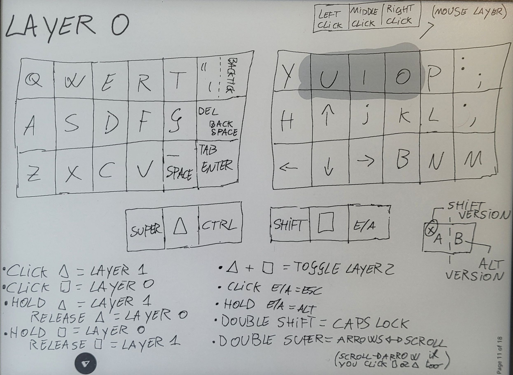
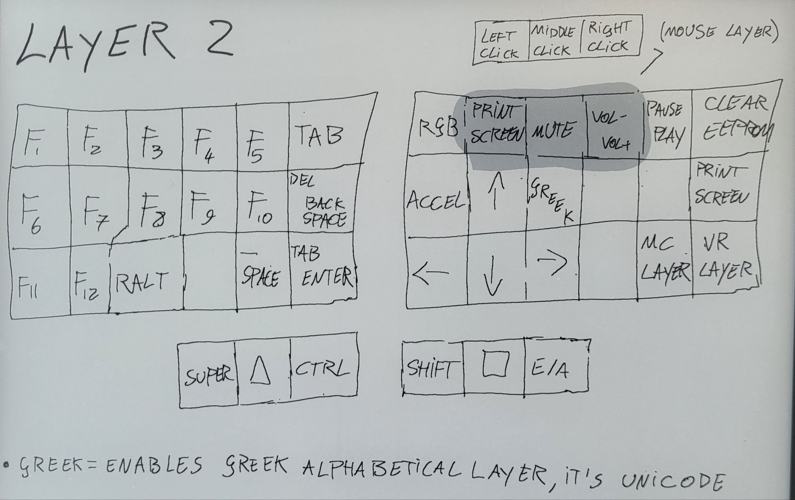

## Executables

* **qmk_file_inject.sh:** inject user files in qmk_firmware

* **flash.sh:** execute qmk_file_inject and qmk flash in user keyboard folder

* **commit_all.sh:** commits all changes, both of qmk_firmware submodule and my_qmk module (main folder) 

# :one: Keyboard


## Keyboard layout
Unicode symbols can be disabled by turning false the flag ```MY_UNICODE_ENABLE``` in rules.mk.<br/>
Unicode support depends on both OS and software used: most recent Linux and Mac OS do support it by default, but you need to install Wincompose for Windows (another reason to avoid it).<br/> 
The keymap I wrote does an automatic OS detection to use the right unicode input method.





## User files and changes to qmk_firmware

* ### Keymap.c, rules.mk, config.h

Add the folder ``` Elil_50 ``` in the following path:
```
./qmk_firmware/keyboards/crkbd/keymaps
```

* ### PS/2 Driver Trackpoint

The host needs pull-up resistors on PS/2 DATA and CLK lines. The built-in pullup resistors from the host 4k to 100k are acceptable. 
So I need to add those pull-up resistors (didn't do it), or apply the following patch:

Add in line 150 of file:
```
./qmk_firmware/platforms/chibios/drivers/vendor/RP/RP2040/ps2_vendor.c
```
The line ``` PAL_RP_PAD_PUE | ``` so that it looks like:
```c
    // clang-format off
    iomode_t pin_mode = PAL_RP_PAD_IE |
                        PAL_RP_GPIO_OE |
                        PAL_RP_PAD_SLEWFAST |
                        PAL_RP_PAD_DRIVE12 |
                        PAL_RP_PAD_PUE |
```

## Hardware

* 2 PCB: Helidox Corne V3, 6 columns
* 2 Keyboard 3D printed cases
* 2 Microcontroller: Elite-Pi
* 1 Trackpoint: SK8707-01-002(3.3V) Integrated

* ### Trackpoint pinout setup


* ### Trackpoint extensor sketch
In order to vertically extend the trackpoint sensor, I 3D printed the following sketch, cut the excess height and manually reduced the diameter of the part which goes inside the PCB. It's probably better to print with 3mm instead of 4mm. I increased the diameter of the PCB holes with a drill.


<br>

---

<br>

# :two: Desktop Enviroment (KDE Plasma)


In ```KDE_Plasma``` folder you can find both monitor overview and keyboard shortcuts files.

* Replace overview.page in the following path:
```
.local/share/plasma-systemmonitor/overview.page
```

* Replace kglobalshortcutsrc in the following path:
```
.config/kglobalshortcutsrc
```

## OS Shortcuts


